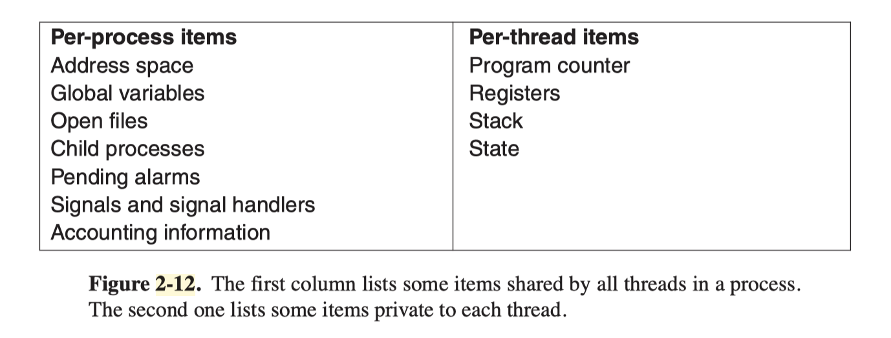

# **Midterm Review**

CSE 130 Principles of Computer Systems Design

Spring 2023

---

# Midterm

- 5/4 7:10-8:45 @ Baskin Auditorium 101
  - Arrive at 7:00 so we can start on time
- Bring a pen and student ID
- Chapter 1: Introduction, Chapter 2: Processes and Threads, Chapter 3: Deadlocks
- Materials
  - Lecture slides
  - Assignments (2 and 3 are on Canvas)
  - Projects

---

# Chapter 1: Introduction

---

# 1

What are the two main functions of an operating system?

---

# 5

On early computers, every byte of data read or written was handled by the CPU (i.e., there was no DMA). What implications does this have for multiprogramming?

---

# 10

What is the difference between kernel and user mode? Explain how having two distinct modes aids in designing an operating system.

---

# Chapter 2: Processes and Threads

---

# 7

Multiple jobs can run in parallel and finish faster than if they had run sequentially. Suppose that two jobs, each needing 20 minutes of CPU time, start simultaneously. How long will the last one take to complete if they run sequentially? How long if they run in parallel? Assume 50% I/O wait.

---

# 14

In Fig. 2-12 the register set is listed as a per-thread rather than a per-process item.

Why? After all, the machine has only one set of registers.

---

# 27

In a system with threads, is there one stack per thread or one stack per process when user-level threads are used? What about when kernel-level threads are used? Explain.

---

# 42

Explain how time quantum value and context switching time affect each other, in a round-robin scheduling algorithm.

---

# 45

Five batch jobs. A through E, arrive at a computer center at almost the same time. They have estimated running times of 10, 6, 2, 4, and 8 minutes. Their (externally determined) priorities are 3, 5, 2, 1, and 4, respectively, with 5 being the highest priority. For each of the following scheduling algorithms, determine the mean process turnaround time. Ignore process switching overhead.

1. Round robin
1. Priority scheduling
1. First-come, first-served (run in order 10, 6, 2, 4, 8)
1. Shortest job first

For 1, assume that the system is multiprogrammed, and that each job gets its fair share of the CPU. For 2 through 4, assume that only one job at a time runs, until it finishes. All jobs are completely CPU bound.

---

# Chapter 3: Deadlocks

---

# 34

Explain the differences between deadlock, livelock, and starvation.

---

# Assignment 3 Q5

A computer has six tape drives, with n processes competing for them. Each process may need up to two drives. For which values of n is the system guaranteed to be deadlock free? Explain
